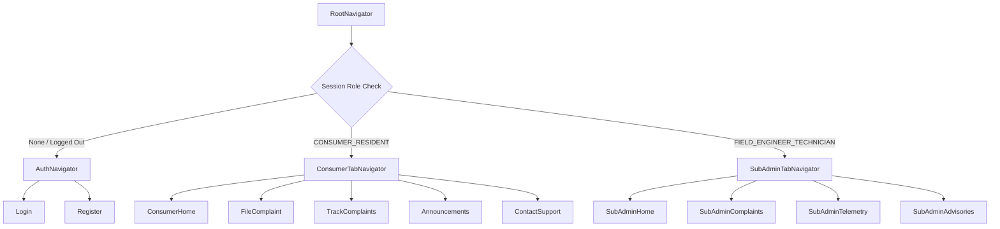

# Implementation Plan - AquaTrack Mobile Application

This document outlines the architecture, screen designs, and implementation steps to develop the mobile version of **AquaTrack** (`aquatrack-mob`) using **Expo/React Native**. The app is tailored for two distinct roles: **Consumers (Residents)** and **Sub-Admins (Field Technicians)**.

---

## Goal Description
Build a production-ready mobile application that mirrors the design aesthetics and features of the AquaTrack Web Platform. 

- **Consumers (Residents)** will be able to:
  1. Authenticate (Register / Login) using Supabase Auth.
  2. File a complaint with photo upload, GPS coordinates, and real-time Gemini AI diagnostic feedback.
  3. Track filed complaints and monitor status changes.
  4. View broadcast bulletins and advisories.
  5. View water district contacts and hotlines.
  
- **Sub-Admins (Field Technicians)** will be able to:
  1. Access a command center showing active work orders, stats, and critical alerts.
  2. Complete crew portal actions (Start Job, Mark as Resolved, and update status).
  3. Monitor IoT telemetry nodes and read live telemetry metrics (pH, turbidity, TDS, pressure).
  4. View and manage all reported citizen complaints.
  5. View staff bulletins and advisories.

The mobile design will adapt the web platform's **premium minimal text-only UI** system—focusing on typographic hierarchy, clean borders, and a professional color scheme (navy `#001e66` and brand azure `#00aeef`).

---

## User Review Required & Architecture Constraints
Based on your feedback, we will organize the mobile codebase using the following folder structure:
1. **Directory Layout**: All pages will live under the `components/` directory:
   *   `components/consumerpages/` - Residents screens and their corresponding CSS style files.
   *   `components/subadminpages/` - Sub-admin / technician screens and their corresponding CSS style files.
   *   `components/authpages/` - Login and Register screens and their corresponding CSS style files.
2. **Style Separation**: Each component will have its styling separated into a dedicated styling file (e.g., `FileComplaint.js` will import styles from `FileComplaint.css.js` or `FileComplaint.styles.js`).
   *   *Note on React Native*: Since standard React Native Metro bundler processes JS StyleSheets, we will name the files `[Name].styles.js` (acting as the CSS stylesheet) to prevent compilation errors on native devices, or use a stylesheet JS configuration.

---

## Open Questions & Requirements
> [!IMPORTANT]
> **1. API Server Address**: During local testing, is the Next.js server running on port `3000`? If yes, we will target `http://10.0.2.2:3000` (Android) and `http://localhost:3000` (iOS).
> **2. Map Integration**: For the complaints screen, we will integrate a native map view using `react-native-maps`. When the user clicks the **"Get Current Location"** button, the app will:
>    * Request location permissions via `expo-location`.
>    * Automatically query the high-accuracy GPS receiver to get the exact coordinates of the reporter.
>    * Animate the map focus to that point, render a red marker at the exact location, and call the web API's `/api/locate-barangay` to automatically detect and show the user's Barangay name.

---

## Proposed Changes



### 1. File Structure Layout

We will create the following layout:
*   `components/authpages/`
    *   `Login.js` & `Login.styles.js`
    *   `Register.js` & `Register.styles.js`
*   `components/consumerpages/`
    *   `ConsumerHome.js` & `ConsumerHome.styles.js`
    *   `FileComplaint.js` & `FileComplaint.styles.js`
    *   `TrackComplaints.js` & `TrackComplaints.styles.js`
    *   `Announcements.js` & `Announcements.styles.js`
    *   `ContactSupport.js` & `ContactSupport.styles.js`
*   `components/subadminpages/`
    *   `SubAdminHome.js` & `SubAdminHome.styles.js`
    *   `SubAdminComplaints.js` & `SubAdminComplaints.styles.js`
    *   `SubAdminTelemetry.js` & `SubAdminTelemetry.styles.js`
    *   `SubAdminAdvisories.js` & `SubAdminAdvisories.styles.js`

### 2. Project Config & Setup

#### [MODIFY] `aquatrack-mob/package.json`
*   Add dependencies for navigation, Supabase JS client, maps, and Expo utilities.
```json
{
  "dependencies": {
    "expo": "~57.0.7",
    "expo-status-bar": "~57.0.1",
    "react": "19.2.3",
    "react-native": "0.86.0",
    "@react-navigation/native": "^6.1.18",
    "@react-navigation/native-stack": "^6.10.1",
    "@react-navigation/bottom-tabs": "^6.6.1",
    "react-native-safe-area-context": "4.12.0",
    "react-native-screens": "~4.4.0",
    "@supabase/supabase-js": "^2.43.4",
    "expo-location": "~18.0.4",
    "expo-image-picker": "~16.0.3",
    "react-native-maps": "1.18.0"
  }
}
```

---

## Verification Plan

### Manual Verification
1.  **Register a Consumer**:
    *   Verify registration updates the User table with `CONSUMER_RESIDENT`.
2.  **File Complaint**:
    *   Click "Get Current Location". Verify the GPS permission prompt is shown, coordinates are set, a red pin appears on the map, and the correct Barangay is returned by the API.
3.  **Technician Action**:
    *   Log in as a technician (`tech@csfwd.gov.ph` or equivalent).
    *   Toggle work order statuses and confirm database sync using Prisma Studio.
